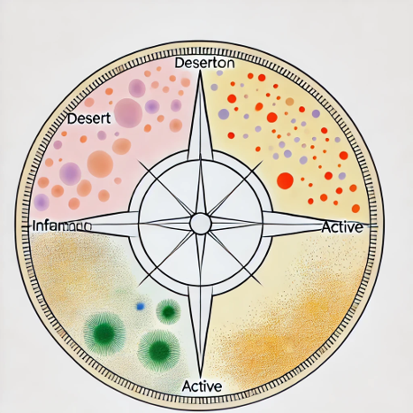

<a href="url"></a>


[](https://www.immuno-compass.com/download/)
[](https://www.immuno-compass.com/download/)


## Compass for cross-cancer AI modeling of immunotherapy response

-----

An `example2run.ipynb` under the example folder is provided to run below experiments. So please navigate to the example folder to run below code:


## 1. Installing and Importing Compass

#### Installation
Clone the repository and install the required dependencies:
```bash
git clone https://github.com/mims-harvard/Immune-compass.git
cd Immune-compass
pip install -r requirements.txt
```

#### Adding Compass to Your Environment
Before importing compass, add it to your Python path:
```python
import sys
sys.path.insert(0, 'your_path/Immune-compass')
```

#### Importing Compass
Now, you can import compass and its key components:
```python
import compass
from compass import PreTrainer, FineTuner, loadcompass
```

## 2. Making Predictions with a Compass Model

You can download all available Compass fine-tuned models [here](https://www.immuno-compass.com/download/) for prediction.

The input `df_tpm` is gene expression tabular data. Please refer [here](https://www.immuno-compass.com/help/index.html#section1) for details on generating input data. The first column represents the cancer code, while the remaining 15,672 columns correspond to genes. Each row represents one patient. An example input file can be downloaded [here](https://www.immuno-compass.com/download/other/compass_gide_tpm.tsv).

The output `df_pred` contains two columns, where `0` indicates non-response and `1` indicates response.

```python
df_tpm = pd.read_csv('./data/compass_gide_tpm.tsv', sep='\t', index_col=0)
# OR directly load the compass model from https://www.immuno-compass.com/download/model/LOCO/pft_leave_Gide.pt 
model = loadcompass('./model/pft_leave_Gide.pt', map_location = 'cpu')
# Use map_location = 'cpu' if you dont have a GPU card
_, df_pred = model.predict(df_tpm, batch_size=128)
```


## 3. Extracting Features with a Compass Model

Both pre-trained (PT) and fine-tuned (FT) Compass models can function as feature extractors. The extracted gene-level, geneset-level, or cell type/pathway-level features can be used to build a logistic regression model for response prediction or a Cox regression model for survival prediction.

```python
# Use any Compass model of your choice
model = loadcompass('./model/pretrainer.pt') 
# OR directly load the model from https://www.immuno-compass.com/download/model/pretrainer.pt 
dfgn, dfgs, dfct = model.extract(df_tpm, batch_size=128, with_gene_level=True)
```

The outputs `dfgn`, `dfgs`, and `dfct` correspond to gene-level (15,672), geneset-level (133), and concept-level (44) features, respectively. The extracted features are scalar scores. If you need vector features (dim=32), use the following method:

```python
dfgs, dfct = model.project(df_tpm, batch_size=128)
```


## 4. Fine-Tuning Compass on Your Own Data

If you have in-house data and would like to fine-tune a Compass model, you can use any Compass model for fine-tuning. You can either load the pre-trained Compass model or a publicly available fine-tuned Compass model.

**Important Note:** If you choose a fine-tuned model for further fine-tune (multi-stage FT), ensure that the `load_decoder` parameter in `ft_args` is set to `True`:
```python
ft_args = {'load_decoder': True}
```

### Example Fine-Tuning Process
```python
model = loadcompass('./model/finetuner_pft_all.pt')  
ft_args = {'mode': 'PFT', 'lr': 1e-3, 'batch_size': 16, 'max_epochs': 100, 'load_decoder': True}
finetuner = FineTuner(model, **ft_args)

# Load the true labels
df_cln = pd.read_csv('./data/compass_gide_clinical.tsv', sep='\t', index_col=0)
dfy = pd.get_dummies(df_cln.response_label)

# Fine-tune the model
finetuner.tune(df_tpm, dfy)
finetuner.save('./model/my_finetuner.pt')
```
This process fine-tunes the Compass model on your data and saves the updated model for future use.


## 5. Pre-training Compass from Scracth
```python
# Load the example dataset for pretraining
# We provide sample datasets contain gene expression data for training and testing
# Ensure the data is preprocessed appropriately before use
tcga_train_sample = pd.read_csv('./data/tcga_example_train.tsv', sep='\t', index_col=0)
tcga_test_sample = pd.read_csv('./data/tcga_example_test.tsv', sep='\t', index_col=0)

# Define pretraining hyperparameters
pt_args = {'lr': 1e-3, 'batch_size': 96, 'epochs': 20, 'seed':42}
pretrainer = PreTrainer(**pt_args)

# Train the model using the provided training and test datasets
# - dfcx_train: Training dataset
# - dfcx_test: Validation dataset to monitor performance
pretrainer.train(dfcx_train=tcga_train_sample,
                 dfcx_test=tcga_test_sample)

# Save the trained pretrainer model for future use
pretrainer.save('./model/my_pretrainer.pt')
```


## 6. Baseline Methods Usage Examples

```python
# Import baseline immune score methods
from baseline.immune_score import immune_score_methods

# Extract features using baseline methods
# These features can be used to develop a logistic regression model for response prediction
res = []
for method_name, method_function in immune_score_methods.items():
    baseline_model = method_function(cancer_type='SKCM', drug_target='PD1')
    scores = baseline_model(df_tpm)
    res.append(scores)

# Combine results into a single DataFrame
pd.concat(res, axis=1).head()
```


## 7. Additional Information

This section provides detailed information to help you get started with the Compass project. We explain how to generate the necessary inputs from raw FASTQ data and introduce our online web server that supports both prediction and feature extraction using our pre-trained Compass models.

### Generating Compass Inputs from Raw FASTQ Data

Generating high-quality inputs is crucial for the optimal performance of the Compass models. Our comprehensive [Compass Data Pre-Processing Guide](https://www.immuno-compass.com/help/index.html) walks you through the entire workflow, ensuring that your raw FASTQ data is processed into a robust format ready for accurate predictions and feature extraction.

### Online Web Server for Prediction and Feature Extraction

To simplify the use of our models, we offer an online web server that enables you to interact directly with the Compass models without local installations. The web server provides two primary functionalities:

- **Prediction:** Submit your processed data to generate model predictions using our [online prediction tool](https://www.immuno-compass.com/predict).
- **Feature Extraction:** Extract key data attributes with our [feature extraction tool](https://www.immuno-compass.com/extract).

These user-friendly services are designed to streamline your workflow and integrate Compass seamlessly into your analytical processes.

### Contributing Your Own Compass Models

We welcome contributions from the community. If you have developed a Compass model that can enhance our project, we encourage you to share it. By contributing your model, you help enrich the Compass ecosystem and promote collaborative innovation. For details on how to submit your model, please refer to our contribution guidelines. You can also [join our Slack channel](https://join.slack.com/t/immuno-compass/shared_invite/zt-2znjho738-YZOfLEGLNEH5eH_0W1TmQg) to discuss and collaborate with other users.

### Citing Our Work

If you use our resources, please cite our work as follows:

Wanxiang Shen, Thinh H. Nguyen, Michelle M. Li, Yepeng Huang, Intae Moon, Daniel Marbach, and Marinka Zitnik. *Cross-cancer AI modeling of immunotherapy response* [J]. medRxiv.

---

We hope this information helps you make the most of the Compass project. If you have any questions or need further assistance, please do not hesitate to contact our support [team](https://www.immuno-compass.com/contact/index.html).
