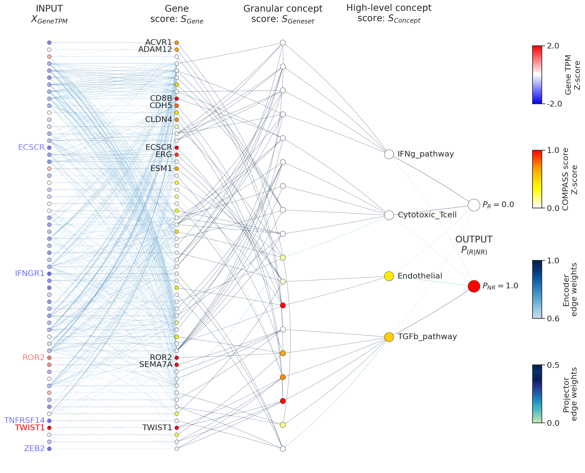
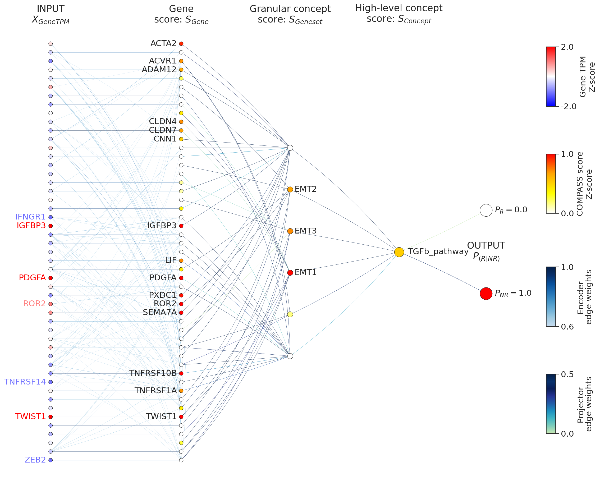

# Personal COMPASS Response Map (CRMap)

This folder contains code and example outputs for generating **Personal COMPASS Response Maps (CRMap)**, as presented in Figure 7 of the COMPASS article.

## Contents
- **`plot_CRMap.ipynb`**  
  Jupyter notebook that demonstrates how to prepare data, build, and visualize patient-specific CRMaps.  
  The notebook uses the COMPASS model to extract hierarchical node scores (gene, geneset, cell type, output) and derives the corresponding edge weights. It then constructs and visualizes a layered graph linking expression (gene TPM) → gene score → geneset score → concept (cell type) score → output (NR/R).

- **`2_ipiPD1_PRE_CRMap.png`**  
  Example CRMap visualization for a representative patient (baseline/pre-treatment, anti-PD1 cohort).

- **`2_ipiPD1_PRE_CRMap_TGFb.png`**  
  Example CRMap visualization for the same patient, with additional emphasis on the TGF-β pathway.

## Example Outputs
Below are two sample figures generated using the notebook:

**Personal CRMap (baseline)**  

**Personal CRMap with TGF-β emphasis**  

## Usage
1. Open `plot_CRMap.ipynb` in JupyterLab or Jupyter Notebook.
2. Follow the steps to:
   - Load the trained COMPASS model checkpoint.
   - Run `prepare_crmap_data` to extract node values and edge weights.
   - Build patient-specific CRMap data using `personal_crmap_data`.
   - Visualize with `draw_personal_crmap`.
3. Modify parameters such as `concept2plot` or `TopK_gene` to tailor the CRMap to specific patients or biological questions.

---

